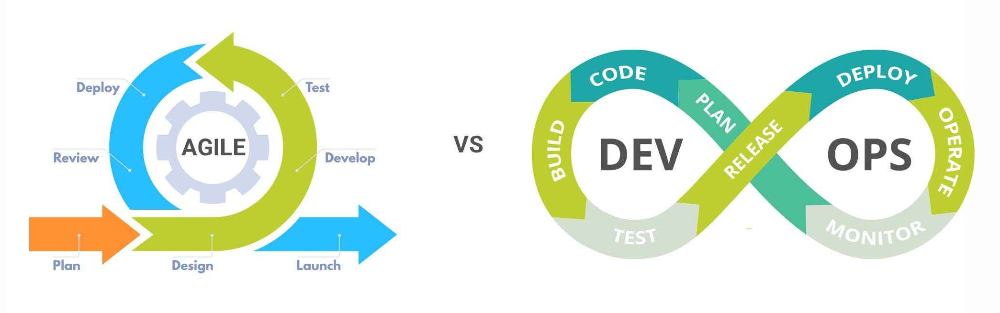
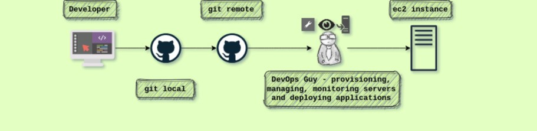
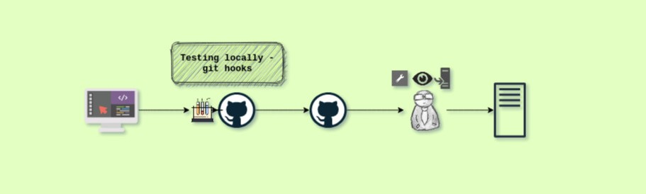
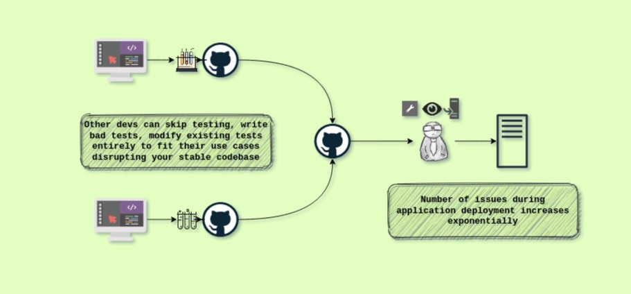
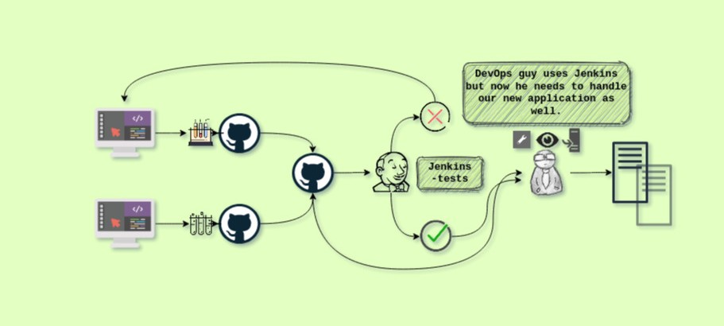
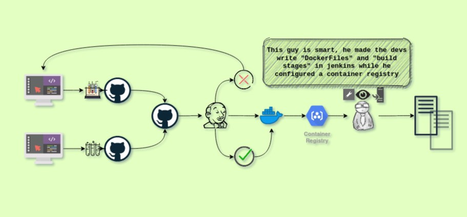
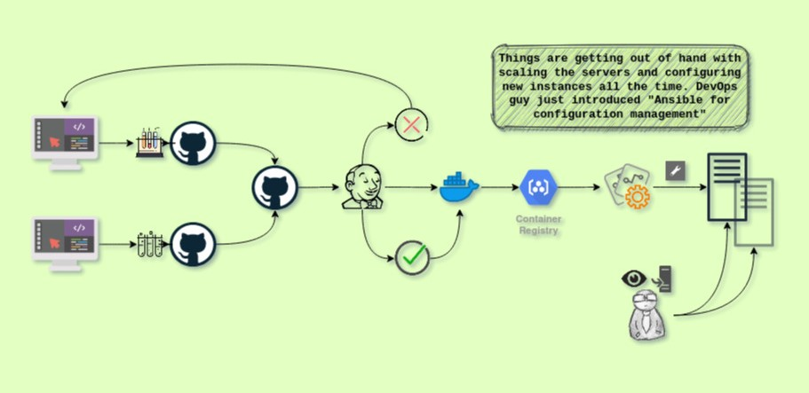
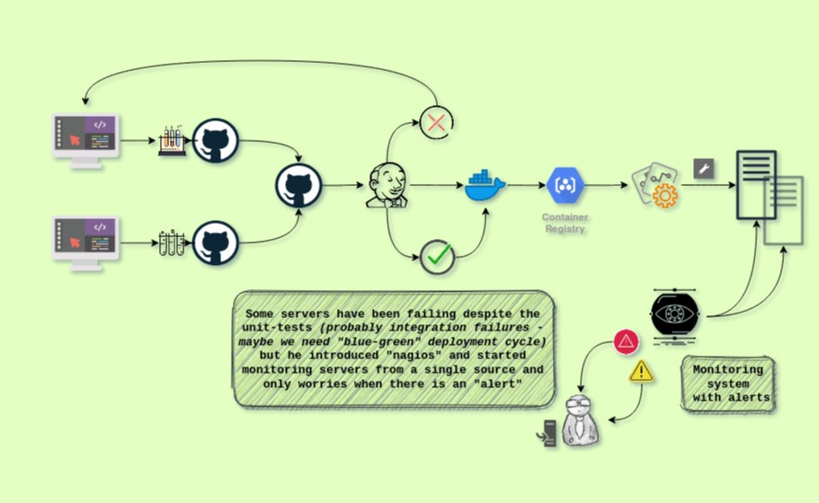
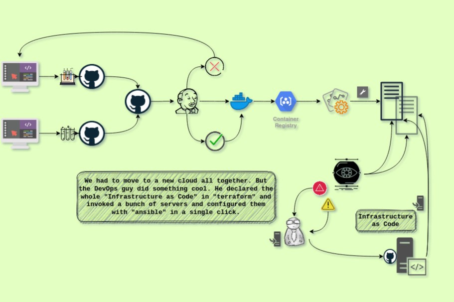
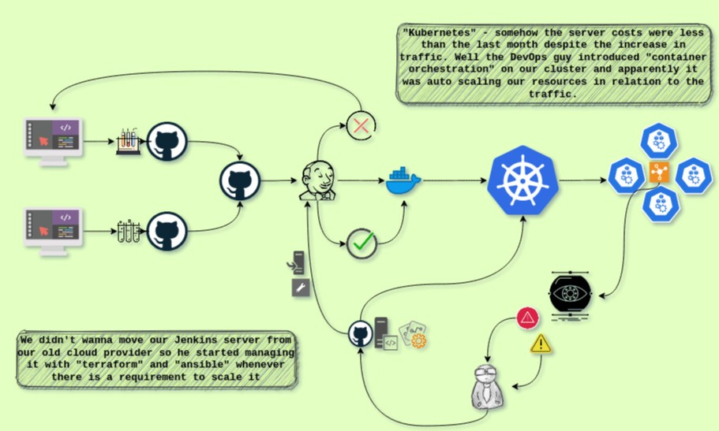

# If DevOps is a culture, how do you study for that ?

## Introduction

I've been trying to speculate what is the best strategy to learn DevOps. 
The above sentence is logically inconsistent according to various definitions of DevOps.

Don't believe me?

- [AWS](https://aws.amazon.com/devops/what-is-devops/):
  DevOps is the combination of cultural philosophies, practices, and tools that increases an organization’s ability to deliver applications and services at high velocity

- [WIKI](https://en.wikipedia.org/wiki/DevOps):
  DevOps is a set of practices that combines software development (Dev) and IT operations (Ops). It aims to shorten the systems development life cycle and provide continuous delivery with high software quality.

- [MICROSOFT](https://azure.microsoft.com/en-us/overview/what-is-devops/):
  A compound of development (Dev) and operations (Ops), DevOps is the union of people, process, and technology to continually provide value to customers.

So it's a philosophy, set of practices, collaboration of different teams, culture with a mission to delivery quality software.

But there is a problem here. Why do people hire DevOps engineers? Let me rephrase the question to a more concrete one. **What/who is a DevOps engineer?**

Every DevOps tutorial/course I've seen so far mentioned the idea of **software development life cycle** and how DevOps addresses some inadequencies of previous methods like waterfall and agile techniques.

But if you look closely and try to understand the transformation from agile to devops, agile already had the structure of work flow figured out. DevOps simply **automated** a bunch of these operations.

Now it makes sense why we need an engineer to solve our **software development life cycle** problem.

## The learning strategy

How does one become a Devops engineer?

To answer this question lets do a thought experiment. Say you just joined at a startup in 2000s (I know feels pretty archaic, but bear with me for a minute) as the devops guy ( the job offer probably said SYS ADMIN at that time )

There you are provisioning servers, managing them, deploying new feature updates, monitoring the performance of the application and generating reports. (Most of them manually, maybe a few shell scripts)

The frequency of bugs and redeploying older versions every other day is too exausting. You introduce test driven programming (unit tests) and the developer writes some pre-commit git hooks to run tests everytime there is a commit. Sincere developer, thank god.

New hires, interns bypassing git hooks by a single option on the command line `git commit --no-verify` and we are doomed again. And sadly git hooks are not commited into the repository.

You study a little about continuous testing and introduce Jenkins in your architecture. You deploy a "Jenkins" server and create a "test stage".

Great atleast there are no bugs in the codebase. But the problems is everyone uses a different version of packages on their personal machine while developing and testing. You introduce "Docker". You'll probably recieve a bit of hate in the beginning for making the developers write Dockerfiles but you can create a bunch of base images for most application types.

Deployment has been a lot easier with docker but the number of applications we provide for our clients have increased exponentially after the last funding. You introduce container management tool like ansible to configure servers (bare machines / virtual machines) so that you don't have to configure one at a time or not able to achieve idempotency with your scripts.

Now that we have a bunch of server and applications running, it has become a 24hrs job of monitoring your servers and fixing them on the go when there is too much traffic. This is absorbing your attention span entirely and if you are on a holiday, all hell breaks loose. You introduce "Monitoring systems like nagios/prometheus" to keep an eye on the applications and "alert" you when anything looks fishy.

Everytime you have to setup a new server, you manually provision the server, setup vpc, subnets, gateways, volumes and then run ansible to configure it. This is a repetition. "Infrastructe as Code" to the rescue. You start looking into hashicorps tools and start using "terraform" to provision infra in configuration language.

Lot of microservices are utilised exesively in working hours and stay completely idle at nights. Everytime there is a huge amount of traffic you have to provision the server and later on destroy them when not at use. You bring a huge change into your infra this time. "Kubernetes". You use this "container orchestration tool" to manage your cluster, autoscale applications when necessary, isolate logically and deploy in a single click.

### The motivation behind this thought experiment is simple and necessary.

DevOps is not learning a bunch of tools and implementing a complicated architecute like in the last image. DevOps engineer should always identify the problem at hand and introduce solutions.

We have endless number of technologies which tackle various scenarios and it is impossible to master them all at once. One should be a **participant in the journey** of developing such a sophisticated system organically.

### What is the strategy then?

- Simulate a scenario like the one we explored earlier
- Build a stable infrastructure for each iteration
- Only then introduce/visualize a new inadequency of the current system
- This will inevitably make you realise what sort of a technology/solution you need.

### Why will this work?

It is absolutely crucial to be a part of the journey because that is precisely what a DevOps engineer has to do on the field.

One has to **safely** tear down a part of existing development and operations cycle and introduce enhanched solutions

To be able to maintain a stable infrastructure which one is still tweaking it is one of the necessary skills and impossible to learn without being a part of the journey.

## Conclusion:

The idea is straight forward here. The **transition** from being a sysadmin or a developer to a DevOps engineer is in itself the primary skill a DevOps engineer possesses. Learning a new technology takes a day or few to master it where as it takes an organisation to technologically scale and mature to produce a DevOps engineer.
